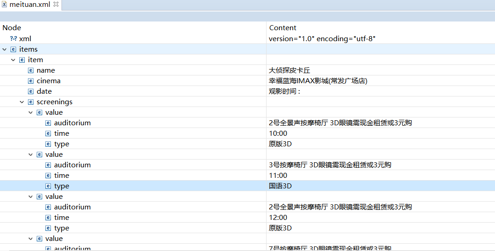
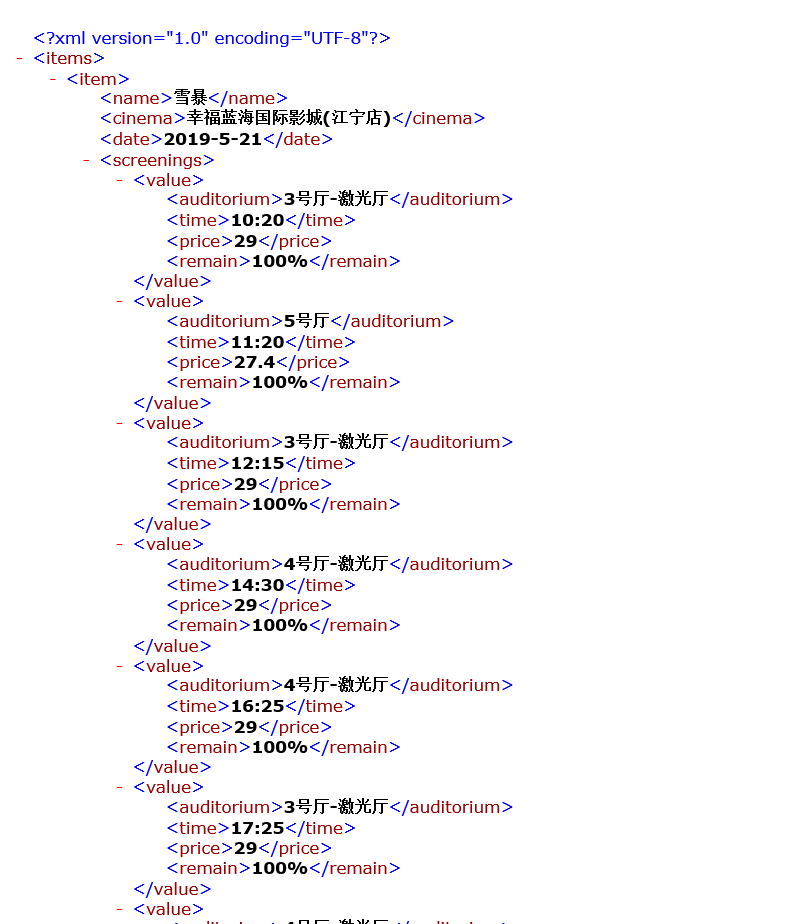
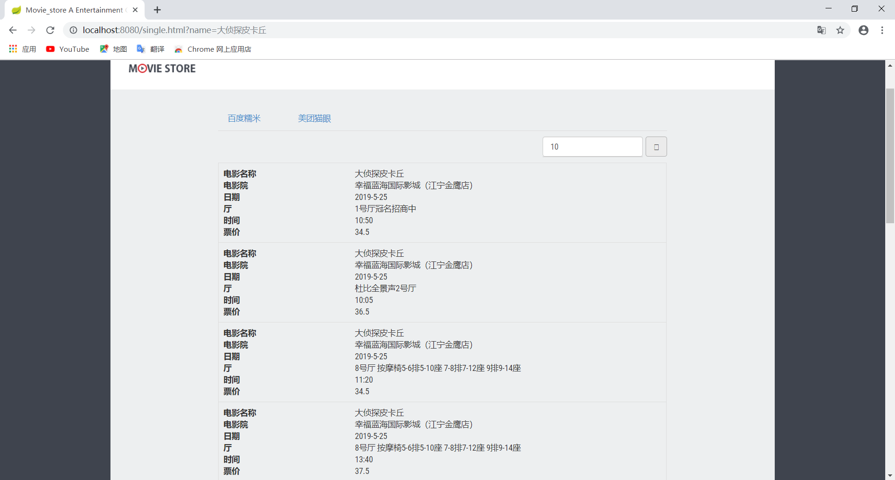
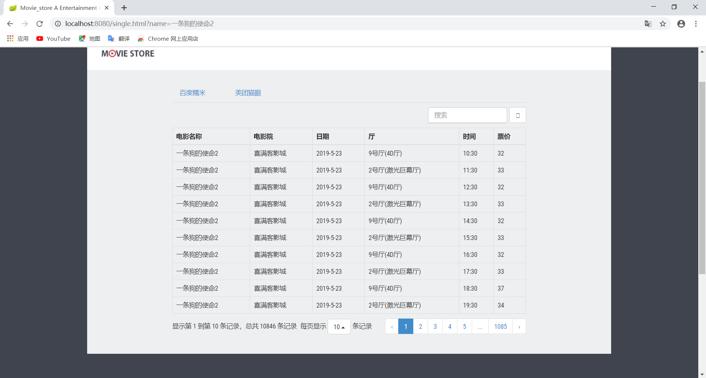

# 应用集成原理与工具
*作业三报告*
## 选题

本次我们选择了主题二并结合当下比较流行的电影为背景，进行数据的获取、集成和展示的实验。这次的文档也依照获取、集成、和展示的顺序来介绍我们所做的工作

## 数据获取

我们采用自己设计的爬虫程序来获取数据，最终成功了集成了[百度糯米]()、[美团猫眼]()两个平台的热映电影、影院和放映场次三方面的信息来作为我们的数据集

## 数据集成

我们采用xml文件来存储两个来源的信息，通过分别建立两个平台的对应电影信息xml文件（meituan.xml和nuomi.xml）存放相关电影信息，

其中每一个item代表一个电影信息，item下的各个属性代表相关电影详细信息，具体结构如下：

存储数据结构展示

数据详情展示：

## 数据展示

采用spring boot等一系列框架作为基本的web项目，采用了bootstrap框架

提供以下功能：

* 主页上最新上映电影展示
* 选择电影进行搜索以及搜索结果展示
* 电影详细信息（区分平台）
* 电影放映场次、票价、影城信息展示（区分平台）

运行截图

主页(会动态展示最新的电影)

搜索页面

电影选择页(电影名称、海报)

电影放映场次

电影评分预测

## 机器学习

在作业三中，经过开会与讨论，我们根据个人习惯以及调查，选取了电影的导演、体裁、上映年份、看过人数、片长、评分作为电影指标，以这些指标预测一部电影的最终评分。为保证指标的统一性，我们同一以中国大陆版本为主，并选取了豆瓣作为数据来源平台，确保指标的合理性与一致性。我们采用了豆瓣提供的接口(参考文档：https://douban-api-docs.zce.me/movie.html#top250)，从豆瓣网上面获取了250组训练集和20组测试集。

考虑到电影指标的多元性与复杂性，经过查阅参文献，我们选择了BRP模型作为电影评分预测模型，该模型基于BPNN（负反馈神经网络）模型，该模型由多层数据构成，将归一化的指标为输入层，评分作为输出层，中间加入隐藏层，经过反复的前向、反向训练计算出各层之间转换参数（也可以理解为各个指标所占的比重），再将新的电影指标传入训练好的网络，通过这些参数进行计算，即可预测电影评分。

## 总结

通过这次作业，我们学习了如何在网络上获取数据和集成不同来源的数据，最重要的是如何处理数据不一致和不匹配等比较麻烦的问题，可以说是收获颇丰

同时，也为下一次的作业打下了基础，更加深刻地认识到了应用集成的重要性。

github : https://github.com/application-integration/Integration-homework
### 小组成员

+ 向宇轩 161250159
+ 王一名 161250147
+ 周鹏     161180205
+ 赵勇     161180202
+ 杨宗文  161250182

